# Kadodo

Un réseau social scolaire (intranet) complet permettant aux étudiants, professeurs, modérateurs et administrateurs d'interagir dans un environnement académique sécurisé.

## 📋 Table des matières

- [Fonctionnalités](#fonctionnalités)
- [Technologies utilisées](#technologies-utilisées)
- [Architecture du projet](#architecture-du-projet)
- [Installation](#installation)
- [Configuration](#configuration)
- [Utilisation](#utilisation)
- [API](#api)
- [Sécurité](#sécurité)
- [Output](#Output)

## 🚀 Fonctionnalités

### Gestion des utilisateurs
- Système d'authentification complet
- 4 types d'utilisateurs : étudiants, professeurs, modérateurs, administrateurs
- Validation des comptes par les administrateurs
- Gestion des profils utilisateurs

### Messagerie
- Chat en temps réel entre utilisateurs
- Indicateur de statut en ligne
- Notifications de nouveaux messages
- Historique des conversations

### Forum
- Création et gestion de sujets
- Système de réponses et commentaires
- Modération des contenus
- Catégorisation des sujets

### Administration
- Tableau de bord complet
- Gestion des utilisateurs
- Validation des inscriptions
- Rapports et statistiques

## 🛠 Technologies utilisées

- **Frontend:**
  - HTML5, CSS3, JavaScript, AJAX
  - Bootstrap 5

- **Backend:**
  - PHP 8.x
  - MySQL

- **Serveur:**
  - Apache
  - XAMPP

## 📁 Architecture du projet

```
myschoolface/
├── admin/              # Administration
├── assets/            # Ressources statiques
├── auth/              # Authentification
├── chats/             # Système de messagerie
├── forum/             # Forum de discussion
├── professors/        # Espace professeurs
├── students/          # Espace étudiants
├── moderators/        # Espace modérateurs
├── uploads/           # Fichiers uploadés
└── utils/             # Utilitaires
```

## ⚙️ Installation

1. Cloner le repository :
```bash
git clone https://github.com/Ltk-Mxz/kadodo.git
```

2. Copier les fichiers dans le dossier htdocs de XAMPP :
```bash
cp -r kadodo /xampp/htdocs/
```

3. Importer la base de données :
```bash
mysql -u root -p < c:\xampp\htdocs\kadodo\config\kadodo_db.sql
```

## 👥 Rôles utilisateurs

- **Administrateur**
  - Gestion complète des utilisateurs
  - Validation des inscriptions
  - Configuration du système

- **Modérateur**
  - Modération du forum
  - Gestion des signalements
  - Surveillance des contenus

- **Professeur**
  - Création de contenus pédagogiques
  - Communication avec les étudiants
  - Suivi des activités

- **Étudiant**
  - Participation aux forums
  - Communication avec les professeurs
  - Accès aux ressources

## 🔒 Sécurité

- Protection contre les injections SQL
- Hashage sécurisé des mots de passe (Bcrypt)
- Validation des formulaires
- Protection CSRF
- Sessions sécurisées
- Filtrage des uploads
- Validation des permissions

## 🔄 API

Le système inclut une API REST pour :
- Gestion des utilisateurs
- Messagerie
- Forum
- Notifications
- etc...

## 📝 Licence

```
MIT License
```

## 📧 Contact

Pour toute question ou suggestion, n'hésitez pas à nous contacter :
- Email : a96.paul96@gmail.com

## Output
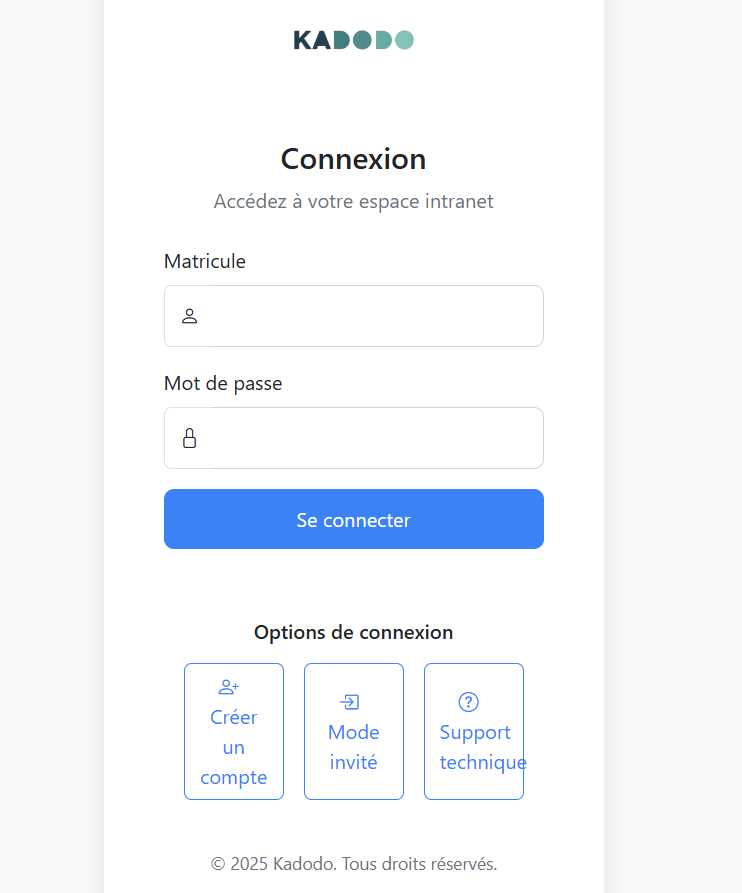


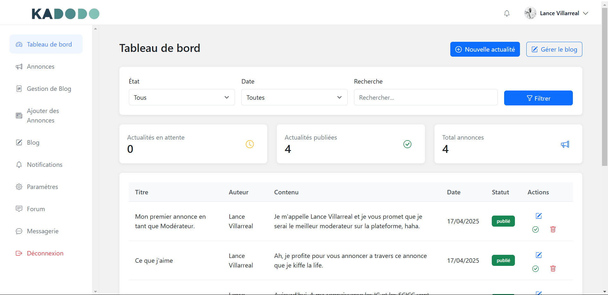

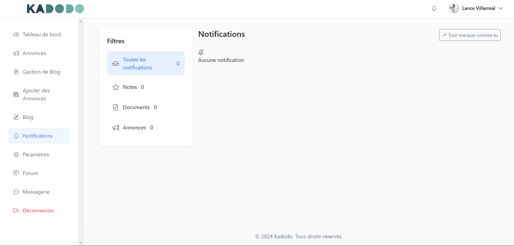

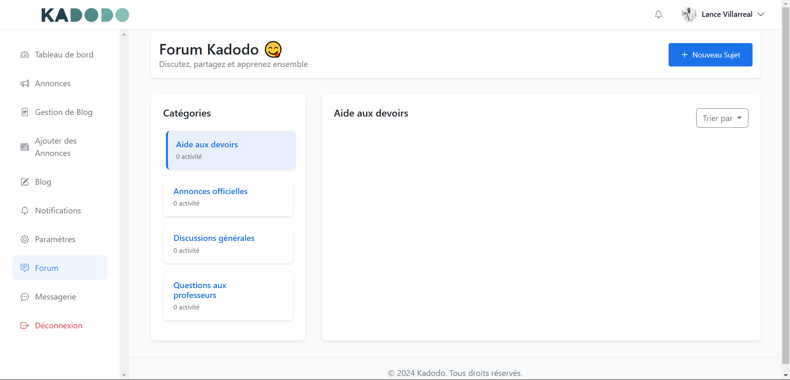

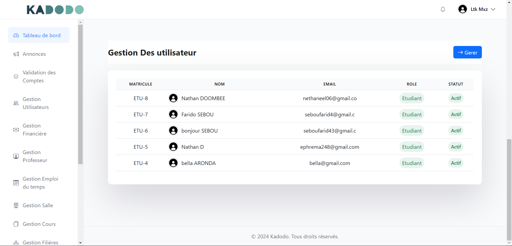

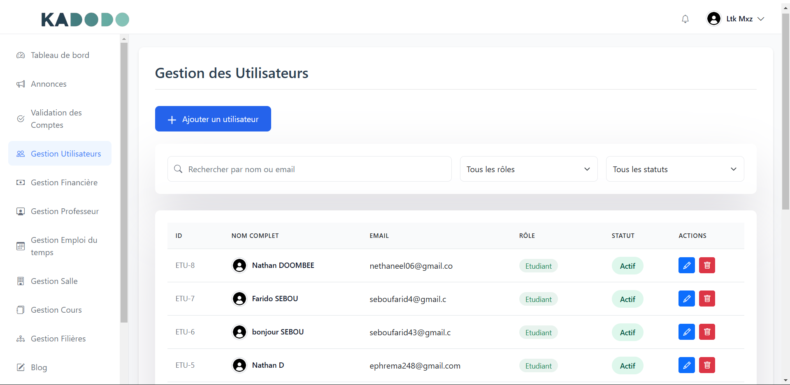

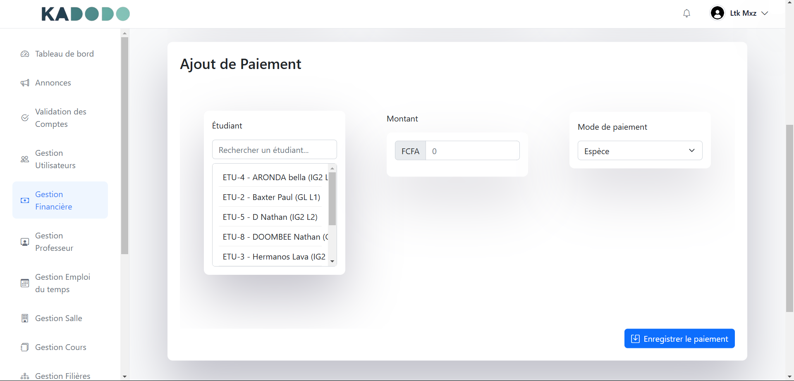


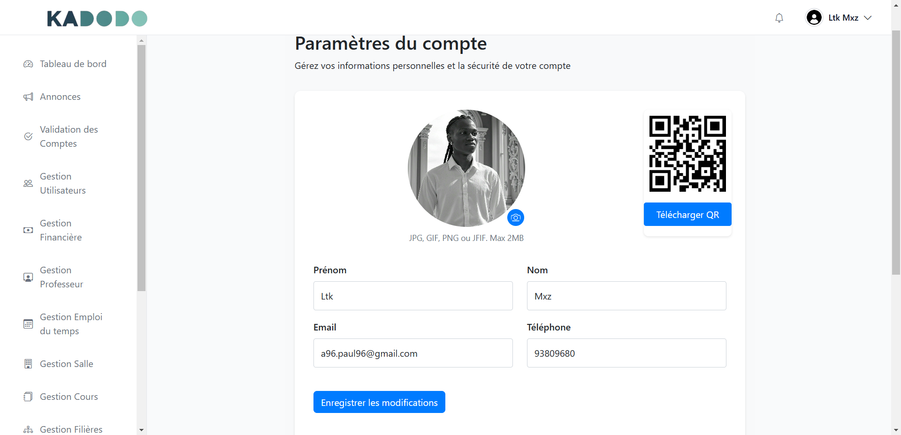

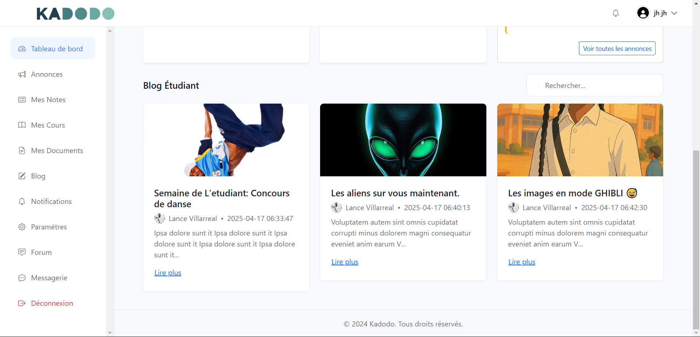

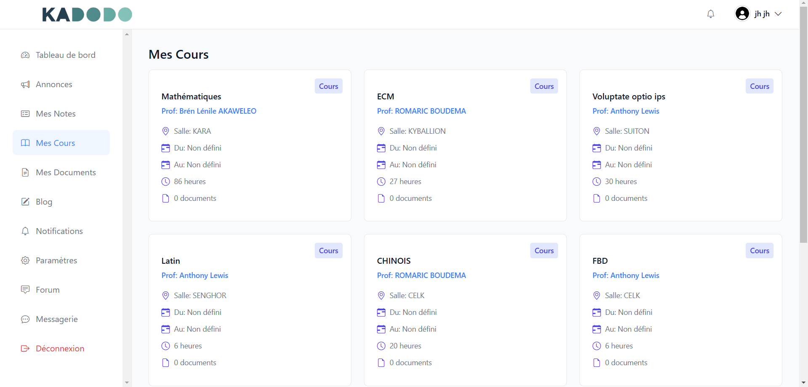

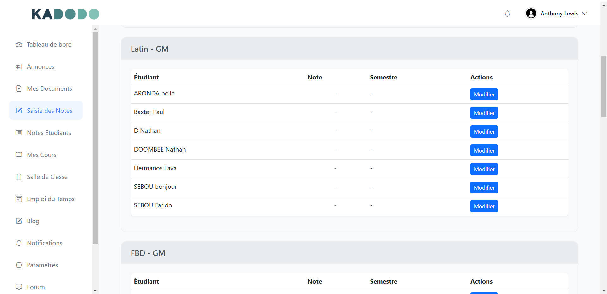

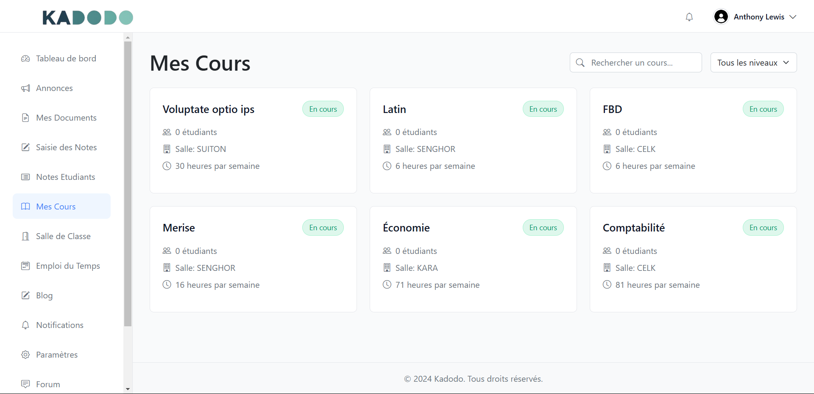

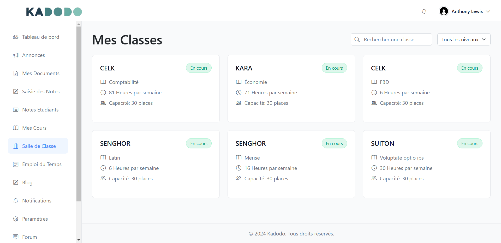
